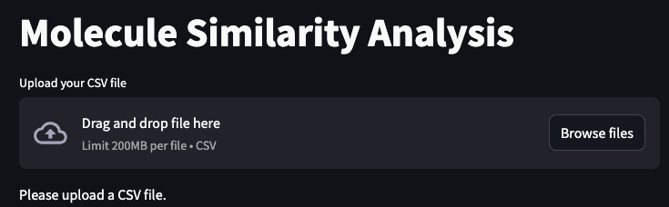
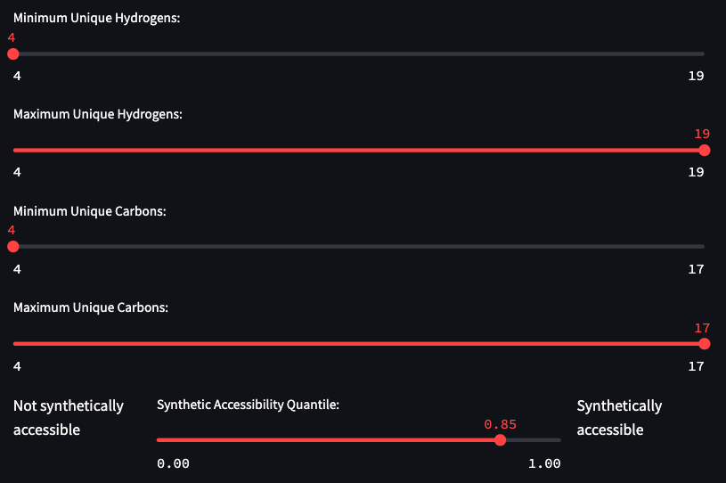
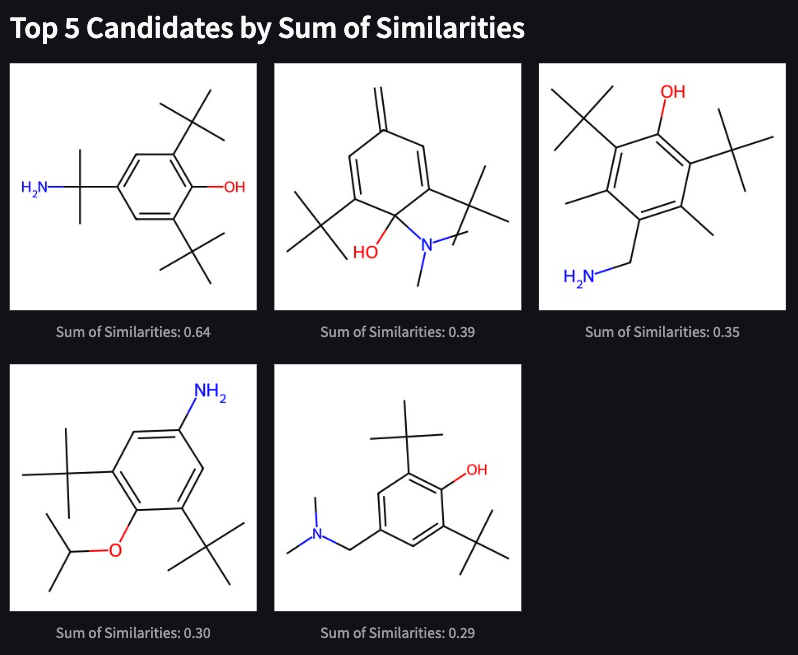

<div align="center">

# How to run the app

</div align="center">

## :package: Install `streamlit`

```sh
pip install streamlit
```

## Have the `csv` ready for upload



## Run app

```sh
streamlit run df_app.py
```

### Adjust your parameters based on what kind of molecule you have

Here you can choose the range of how many unique hydrogens/carbons are in your molecule.



### Visualize candidates

You can adjust by what metric to list of candidates. For example, here are the best metrics for the sum of similarities across different methods.


